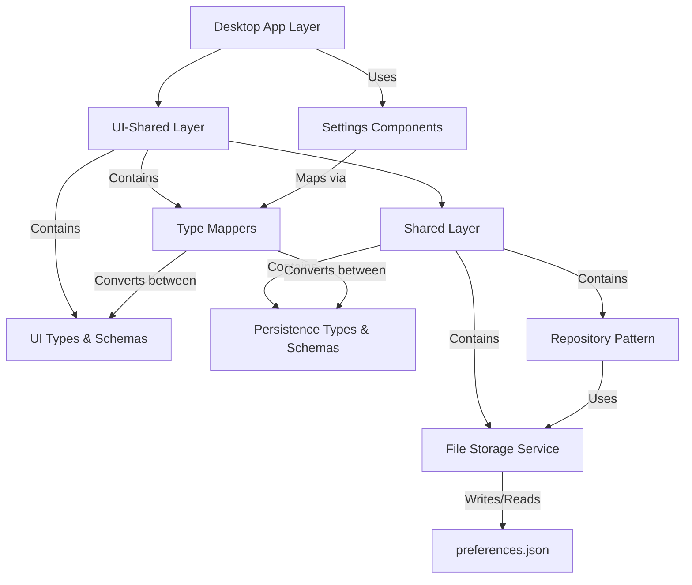

# Settings Persistence System for Fishbowl Desktop

## Executive Summary

Implement a settings persistence system for the Fishbowl desktop application that saves user preferences to a JSON file. This is the first vertical slice of data persistence in the product, focusing initially on populating the settings modal with saved preferences without yet applying those settings to the application.

## Functional Requirements

### Settings Categories

The system must persist settings from three tabs in the desktop settings modal:

1. **General Settings**
   - Auto Mode Settings: response delay, maximum messages, maximum wait time
   - Conversation Defaults: default mode (manual/auto), maximum agents
   - Other Settings: check for updates toggle

2. **Appearance Settings**
   - Theme selection (light/dark/system)
   - Display settings: show timestamps (always/hover/never), show activity time, compact list
   - Chat display: font size, message spacing (compact/normal/relaxed)

3. **Advanced Settings**
   - Developer options: debug logging toggle
   - Experimental features toggle

### Data Persistence

- Settings must be saved to a file named `preferences.json`
- File location: application's userData directory (`app.getPath('userData')`)
- Changes made in the settings modal should update the JSON file when saved
- When the settings modal opens, it should read and populate from the JSON file

### Scope Limitations

- **Not included**: Applying settings to the application (e.g., actually changing themes)
- **Not included**: Import/export functionality
- Focus is solely on persisting and retrieving settings data

## Technical Requirements

### Architecture Overview

The implementation follows a three-layer architecture with clear separation of concerns:

### Layer Responsibilities

#### Shared Package (`@fishbowl-ai/shared`)

- **Complete isolation**: No knowledge of UI-shared package
- Define persistence-specific types for settings data
- Implement Zod schemas for validation of persisted data
- Provide repository pattern for settings persistence
- Implement generic file storage service for JSON operations
- All operations must be async (Promise-based)
- Throw errors for UI layer to handle

#### UI-Shared Package (`@fishbowl-ai/ui-shared`)

- Map between UI form types and persistence types
- Provide mapping utilities that both desktop and future mobile apps can use
- Maintain existing UI types and form schemas

#### Desktop App

- Integrate persistence with existing settings components
- Handle errors from the shared layer
- Trigger save/load operations based on user actions

### Implementation Details

#### Type System

- Create new persistence types in shared package (separate from UI types)
- Persistence types should be optimized for storage, not UI concerns
- UI-shared package handles all type conversions

#### Validation

- Use Zod for schema validation in both layers
- Shared package: schemas for persisted data structure
- UI-shared package: existing schemas for form validation
- Provide sensible defaults for missing or invalid fields

#### File Storage

- Repository pattern for settings (e.g., `SettingsRepository`)
- Generic file storage capabilities for future data types
- JSON file operations with proper error handling
- Async operations throughout

#### Error Handling

- File operation errors thrown to UI layer
- No silent failures - all errors must be propagated
- UI layer decides how to present errors to users

## Acceptance Criteria

### Functional Criteria

1. **Settings Persistence**
   - ✓ All settings from General, Appearance, and Advanced tabs can be saved
   - ✓ Settings persist between application restarts
   - ✓ Opening settings modal loads previously saved values
   - ✓ Saving settings updates the preferences.json file

2. **File Management**
   - ✓ preferences.json is created in the correct userData directory
   - ✓ File is created on first save if it doesn't exist
   - ✓ Existing file is updated, not replaced entirely

3. **Data Integrity**
   - ✓ Invalid data in JSON file doesn't crash the application
   - ✓ Missing fields are populated with sensible defaults
   - ✓ Schema validation ensures data consistency

### Technical Criteria

1. **Architecture Compliance**
   - ✓ Shared package has no imports from ui-shared
   - ✓ All persistence logic resides in shared package
   - ✓ Type mapping logic resides in ui-shared package
   - ✓ Repository pattern is properly implemented

2. **Code Quality**
   - ✓ All operations are async/Promise-based
   - ✓ Proper TypeScript types throughout
   - ✓ Zod schemas for validation
   - ✓ Clean separation of concerns

3. **Error Handling**
   - ✓ File read errors are propagated to UI
   - ✓ File write errors are propagated to UI
   - ✓ Validation errors are handled appropriately
   - ✓ No silent failures

### Testing Criteria

1. **Unit Tests**
   - ✓ Repository methods are tested
   - ✓ Type mappers are tested
   - ✓ Schema validation is tested
   - ✓ Error cases are covered

2. **Integration Tests**
   - ✓ Full save/load cycle works correctly
   - ✓ Settings persist across app restarts
   - ✓ Invalid file handling works correctly

## Non-Functional Requirements

### Performance

- File operations should not block the UI
- Settings should load quickly on modal open (< 100ms)
- Save operations should complete quickly (< 200ms)

### Security

- No sensitive data should be stored in preferences.json
- File permissions should be appropriate for user data

### Maintainability

- Clear separation between layers
- Generic file storage for future data types
- Well-documented interfaces and types

### Compatibility

- System must work on all desktop platforms (Windows, macOS, Linux)
- Future mobile compatibility through shared mapping functions

## Success Metrics

- Settings are successfully persisted and retrieved
- No data loss between saves
- Clean architecture enables easy addition of new settings
- Mobile team can reuse mapping logic when implementing mobile settings

### Log
