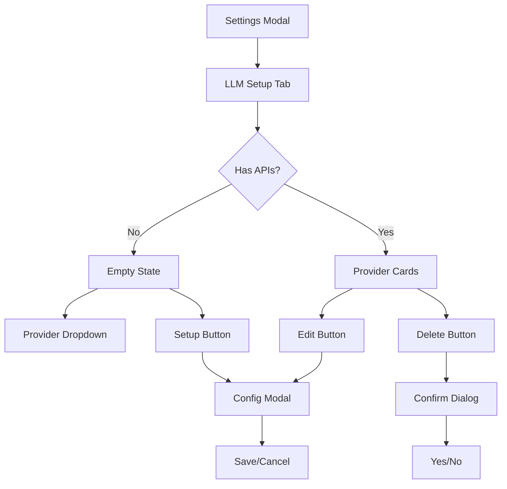

## Overview

Complete transformation of the existing "API Keys" settings tab into a comprehensive "LLM Setup" interface. This epic encompasses all UI/UX implementation, code cleanup, and documentation updates required to deliver an intuitive user experience for configuring multiple LLM provider APIs through modal-based configuration flows.

## Scope and Deliverables

### 1. UI Component Implementation

- **Empty State Component**: Centered layout with provider dropdown and setup button
- **Configuration Modal**: Stacked modal with form fields for API configuration
- **Provider Cards**: Full-width cards displaying configured APIs with edit/delete actions
- **Delete Confirmation Dialog**: Simple confirmation flow for API deletion
- **Form Components**: Custom name input, API key field with show/hide, base URL input, and authorization header checkbox

### 2. Code Migration and Cleanup

- Rename all "API Keys" references to "LLM Setup" throughout the codebase
- Remove deprecated ApiKeysSettings component and related files
- Update type definitions from "api-keys" to "llm-setup"
- Update navigation and routing references
- Clean up any unused imports or dependencies

### 3. Integration Updates

- Update SettingsContent.tsx to use new LlmSetupSection component
- Update SettingsNavigation.tsx with new tab naming
- Ensure proper modal stacking with existing settings modal
- Implement keyboard shortcuts (Ctrl/Cmd+S, Escape)

### 4. Documentation Updates

- Update any user-facing documentation referencing "API Keys"
- Add inline code documentation for new components
- Update component README files if they exist

## Detailed Acceptance Criteria

### UI/UX Requirements

- ✓ Tab displays "LLM Setup" in navigation and headers
- ✓ Empty state shows centered message with provider dropdown (OpenAI, Anthropic)
- ✓ Setup button opens configuration modal on top of settings modal
- ✓ Configuration modal contains all specified form fields with proper input types
- ✓ API key field includes functional show/hide toggle
- ✓ Base URL field displays provider-specific defaults
- ✓ Configured APIs display as full-width cards in vertical list
- ✓ Each card shows custom name, provider type, edit and delete buttons
- ✓ Edit button opens modal with pre-filled current values
- ✓ Delete button triggers confirmation dialog
- ✓ All interactions follow existing UI patterns and use shadcn/ui components

### Code Quality Requirements

- ✓ All "api-keys" references replaced with "llm-setup"
- ✓ Old ApiKeysSettings component and related files removed
- ✓ New components follow existing architectural patterns
- ✓ TypeScript types properly defined for all new components
- ✓ No console errors or warnings
- ✓ Code follows existing naming conventions and file structure

### User Experience Requirements

- ✓ Smooth 200ms transitions for modal open/close
- ✓ No lag when switching between states
- ✓ Keyboard navigation fully supported
- ✓ Proper focus management for modal interactions
- ✓ ARIA labels and descriptions for accessibility

## Technical Architecture

### Component Structure

```
apps/desktop/src/components/settings/
├── LlmSetupSection.tsx (main component)
├── llm-setup/
│   ├── LlmConfigModal.tsx
│   ├── LlmProviderCard.tsx
│   ├── EmptyLlmState.tsx
│   └── index.ts
```

### State Management

- Component-local state only (no persistence)
- UI state managed with React hooks
- Form state handled with React Hook Form

### Key Dependencies

- Existing shadcn/ui components (Dialog, Button, Input, etc.)
- React Hook Form for form handling
- Tailwind CSS for styling
- Existing modal stacking patterns

## Component Interaction Flow



## Implementation Approach

1. **Phase 1: Setup and Cleanup**
   - Create new component structure
   - Remove old API Keys components
   - Update navigation and routing

2. **Phase 2: Core Components**
   - Implement EmptyLlmState with dropdown
   - Create LlmProviderCard component
   - Build main LlmSetupSection container

3. **Phase 3: Modal Implementation**
   - Develop LlmConfigModal with form
   - Implement modal stacking behavior
   - Add keyboard shortcuts

4. **Phase 4: Interactions and Polish**
   - Add delete confirmation dialog
   - Implement transitions and animations
   - Ensure accessibility compliance

## Non-functional Requirements

### Performance

- Modal animations complete within 200ms
- Form interactions respond immediately
- No memory leaks from event listeners

### Maintainability

- Clear component boundaries
- Reusable form patterns
- Consistent with existing codebase patterns

### Accessibility

- Full keyboard navigation support
- Screen reader compatibility
- Proper ARIA attributes
- Focus management for modals

## Success Metrics

- Complete removal of "API Keys" references
- All UI components functioning as specified
- No regression in existing settings functionality
- Clean, maintainable code following project standards

### Log
