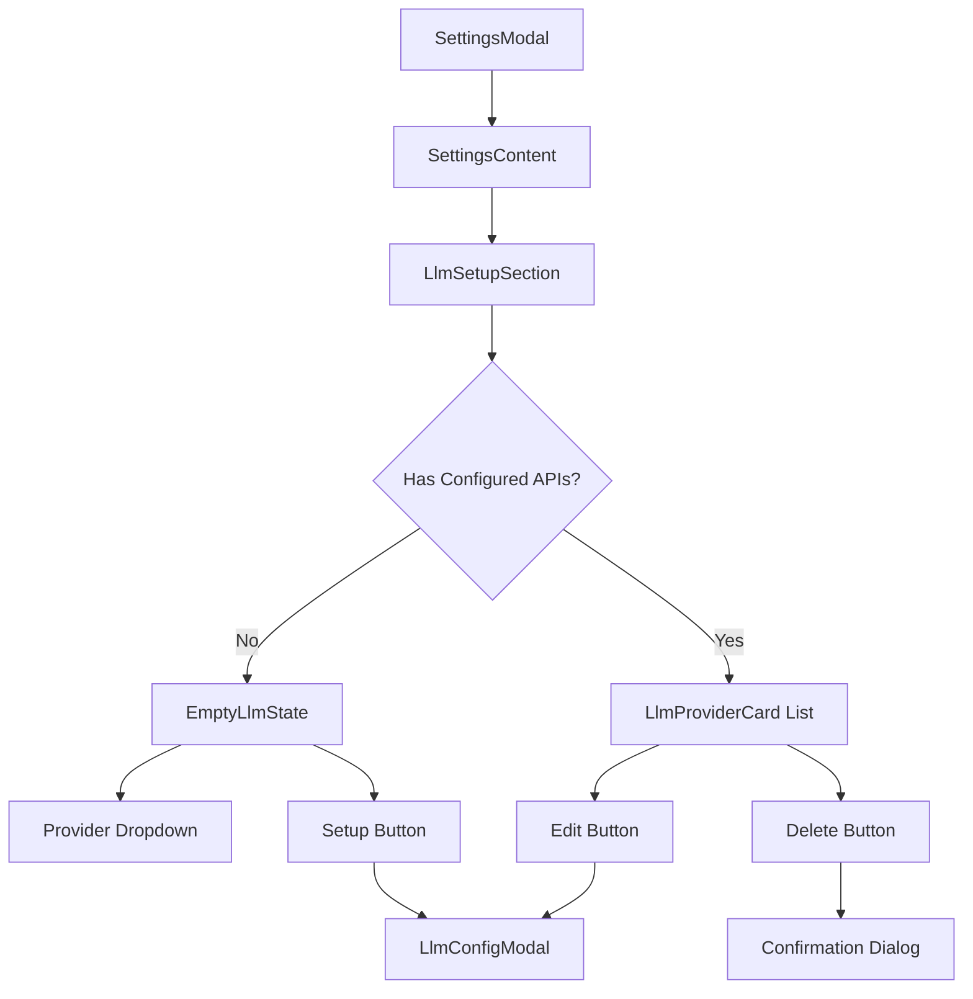
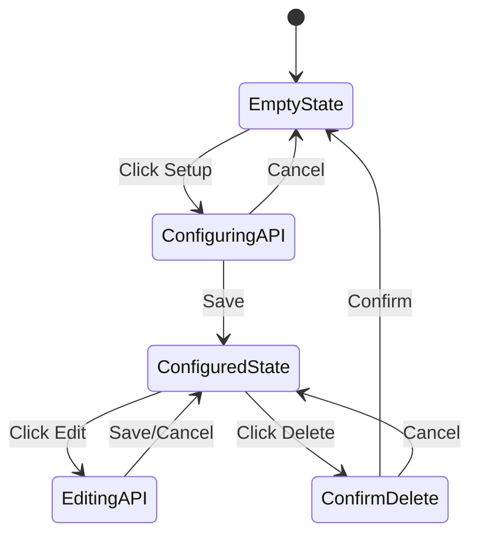

## Executive Summary

Transform the existing "API Keys" settings tab into a comprehensive "LLM Setup" interface that provides an intuitive user experience for configuring multiple LLM provider APIs. This is a UI/UX-only implementation focusing on visual design, user interactions, and modal-based configuration flows without backend functionality.

## Detailed Functional Requirements

### 1. Tab Renaming

- Rename "API Keys" tab to "LLM Setup" throughout the application
- Update navigation labels, section headers, and any references in the codebase

### 2. Empty State Experience

When no APIs are configured:

- Display a centered empty state with descriptive text explaining the purpose
- Show a dropdown menu listing available providers (OpenAI, Anthropic)
- Include a button below the dropdown to initiate API setup
- Follow existing empty state patterns from the codebase (similar to EmptyLibraryState in agents)

### 3. API Configuration Modal

When user clicks setup button:

- Open a new modal on top of the existing settings modal (following AgentFormModal pattern)
- Modal contains a form with the following fields:
  - Custom name field (text input) - e.g., "My ChatGPT API"
  - API key field (password input with show/hide toggle)
  - Base URL field (text input with default values)
  - Checkbox for "Send API key in authorization header"
- Include Save and Cancel buttons
- No validation required - accept any input as this is UI-only
- Implement keyboard shortcuts (Ctrl/Cmd+S to save, Escape to close)

### 4. Configured APIs Display

When APIs are configured:

- Display APIs as full-width cards in a vertical list
- Each card shows:
  - Custom name given by the user
  - Provider type (OpenAI/Anthropic)
  - Edit button - opens the modal with pre-filled values
  - Delete button - triggers confirmation dialog
- Cards should follow the existing ProviderCard design patterns

### 5. Delete Confirmation

When user clicks delete:

- Show simple confirmation dialog: "Delete API Configuration?"
- Options: Yes/No buttons
- Use existing confirmation dialog patterns from the codebase

## Technical Requirements and Constraints

### Architecture Overview

- **Component Structure**: Follow existing settings section patterns
- **State Management**: UI state only, no persistence
- **Modal System**: Implement stacked modal pattern (modal on modal)
- **Form Handling**: Use React Hook Form for consistency
- **Styling**: Use existing Tailwind classes and shadcn/ui components

### File Structure

```
apps/desktop/src/components/settings/
├── LlmSetupSection.tsx (main component, replaces ApiKeysSettings.tsx)
├── llm-setup/
│   ├── LlmConfigModal.tsx (configuration modal)
│   ├── LlmProviderCard.tsx (individual API card)
│   ├── EmptyLlmState.tsx (empty state component)
│   └── index.ts (barrel exports)
```

### Component Integration

- Update SettingsContent.tsx to import and use LlmSetupSection
- Update SettingsNavigation.tsx to change "API Keys" to "LLM Setup"
- Update settingsSection.ts type to rename "api-keys" to "llm-setup"
- Update all test files referencing "api-keys"

## User Stories

1. **As a user**, I want to see "LLM Setup" instead of "API Keys" so the purpose is clearer
2. **As a user**, I want a simple dropdown to choose which LLM provider to configure
3. **As a user**, I want to give my API configurations custom names for easy identification
4. **As a user**, I want to edit my API configurations without re-entering everything
5. **As a user**, I want confirmation before deleting an API configuration

## Detailed Acceptance Criteria

### Tab Renaming

- ✓ Navigation shows "LLM Setup" instead of "API Keys"
- ✓ Section header displays "LLM Setup"
- ✓ All code references updated from "api-keys" to "llm-setup"
- ✓ Tests pass with new naming

### Empty State

- ✓ Centered layout with clear messaging about LLM setup purpose
- ✓ Dropdown shows "OpenAI" and "Anthropic" as options
- ✓ Button below dropdown labeled appropriately (e.g., "Set up [Provider]")
- ✓ Clicking button opens configuration modal

### Configuration Modal

- ✓ Modal opens on top of settings modal with proper overlay
- ✓ Form displays all required fields with appropriate input types
- ✓ API key field has functional show/hide toggle
- ✓ Base URL field shows provider-specific defaults
- ✓ Save button closes modal and updates UI state
- ✓ Cancel button closes modal without changes
- ✓ Escape key closes modal
- ✓ Ctrl/Cmd+S triggers save action

### Configured APIs Display

- ✓ Cards display in vertical list with full width
- ✓ Each card shows custom name prominently
- ✓ Provider type is clearly indicated
- ✓ Edit button opens modal with current values pre-filled
- ✓ Delete button is visually distinct (destructive action)
- ✓ Card design matches existing UI patterns

### Delete Functionality

- ✓ Delete button triggers confirmation dialog
- ✓ Dialog shows "Delete API Configuration?" message
- ✓ Yes button removes card from display
- ✓ No button closes dialog without changes
- ✓ Focus returns to appropriate element after dialog closes

### Accessibility

- ✓ All interactive elements are keyboard accessible
- ✓ Proper ARIA labels and descriptions
- ✓ Focus management for modal interactions
- ✓ Screen reader announcements for actions

## Non-functional Requirements

### Performance

- Modal opening/closing animations smooth (200ms transitions)
- No lag when switching between empty and configured states
- Form interactions responsive without delay

### Browser Compatibility

- Desktop application only (Electron)
- No mobile responsiveness required
- Focus on desktop interaction patterns

### Code Quality

- Follow existing patterns for settings sections
- Maintain consistent naming conventions
- Include proper TypeScript types
- Add comprehensive comments for UI logic

## Architecture Diagrams

### Component Hierarchy



### State Flow



## Implementation Notes

- Leverage existing UI components (Dialog, Button, Input, etc.)
- Follow established modal stacking patterns from agents section
- Use existing form handling patterns with React Hook Form
- Maintain consistency with current settings UI/UX
- No actual API calls or data persistence required
- All state is component-local for this UI-only implementation

### Log
